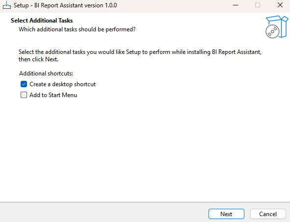
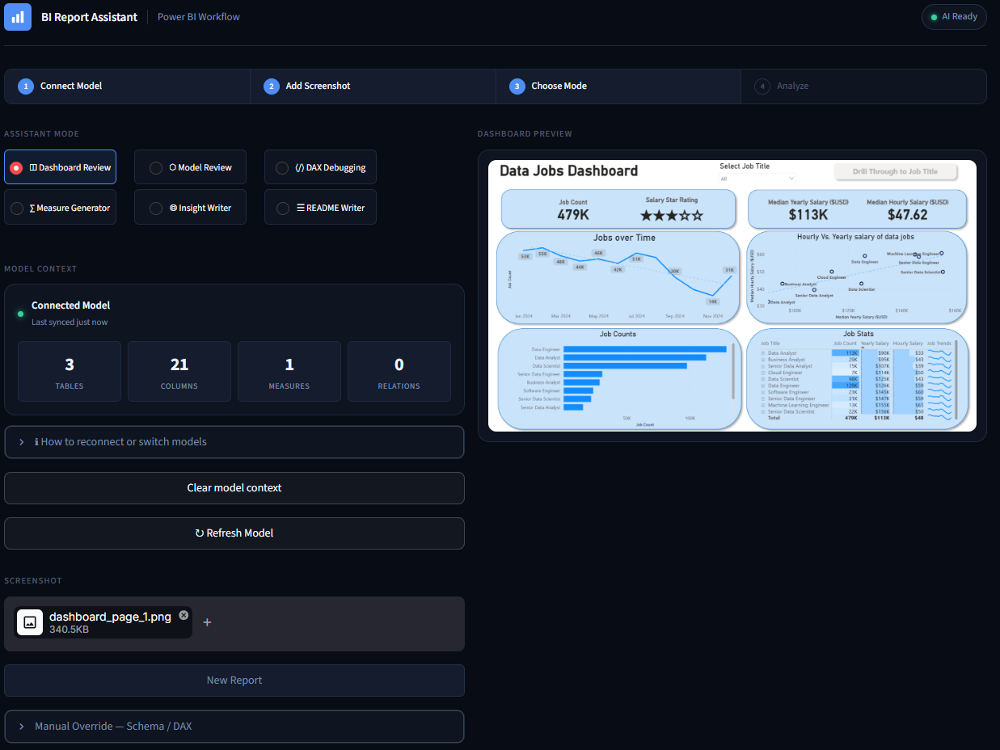
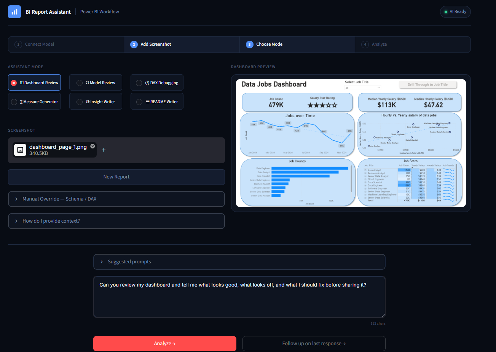
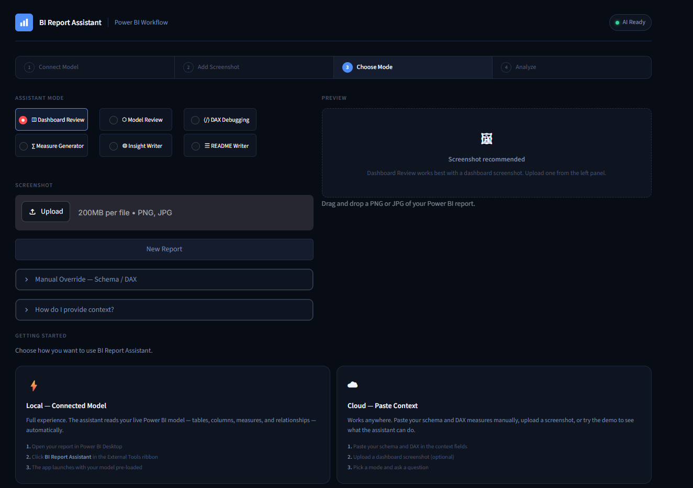
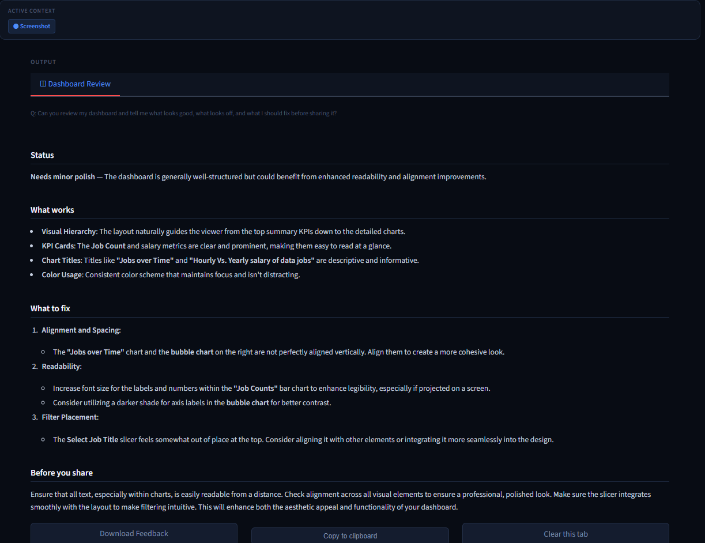
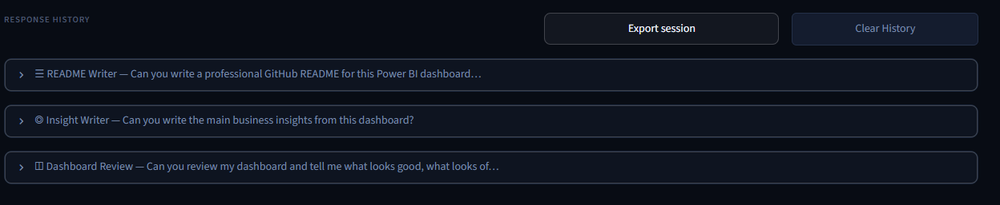

# BI Report Assistant

An AI-powered workflow tool for Power BI developers. Review dashboards, audit data models, debug DAX measures, generate business insights, and write documentation — all from a single interface connected directly to your open PBIX file.

Built with Streamlit and the OpenAI API. Ships as a one-click Windows installer that registers itself as a Power BI External Tool automatically.

## Download

👉 **[Download the latest installer from Releases](https://github.com/MattQ05/bi-report-assistant/releases/latest)**

No Python installation required. Download, run the installer, enter your OpenAI API key, and you're done.

> Note: This installer is currently unsigned, so Windows SmartScreen may show a warning. Click **More info → Run anyway** if you trust the source.
---

## What it does

Six focused AI modes, each tailored to a specific stage of the Power BI workflow:

| Mode | What it does |
|---|---|
| **Dashboard Review** | Reviews layout, visual hierarchy, spacing, and presentation readiness |
| **Model Review** | Audits table structure, relationships, naming, and star schema design |
| **DAX Debugging** | Finds syntax errors, logic issues, and missing patterns across all measures |
| **Measure Generator** | Suggests practical DAX measures based on your schema and existing measures |
| **Insight Writer** | Turns dashboard metrics into executive-ready business insights |
| **README Writer** | Writes a polished GitHub README for your Power BI project |

---

## Who this is for

BI Report Assistant is useful for:

- Power BI developers reviewing reports before sharing
- Analysts debugging DAX or generating new measures
- Students building portfolio dashboards
- Teams documenting BI projects
- Anyone who wants structured feedback on dashboards, models, and insights

---

## Installation

### Windows Installer (recommended)

1. Download `BI-Report-Assistant-Setup-1.0.0.exe` from [Releases](https://github.com/MattQ05/bi-report-assistant/releases/latest)
2. Run the installer — Windows may show a SmartScreen warning, click **More info → Run anyway**
3. Complete the first-time setup wizard — enter your OpenAI API key



4. Restart Power BI Desktop
5. Click **BI Report Assistant** in the **External Tools** ribbon


The app launches automatically with your model pre-loaded.

---

## Two ways to use it

### Local — Connected Model (recommended)

When launched from Power BI Desktop via the External Tools ribbon, the app automatically extracts your live model — tables, columns, measures, and relationships — and loads it as context. No copying and pasting.



### Cloud — Paste Context

Use the app from anywhere by pasting your schema and DAX measures manually, or uploading a dashboard screenshot. No Power BI Desktop required.



---

## Screenshots

### Getting started



### Dashboard Review output



### Response history with re-run



---

## Features

- **One-click installer** — ships as a Windows `.exe` that installs the app, registers the External Tool, and runs the setup wizard automatically
- **Live model connection** — extracts tables, columns, measures, and relationships from the open PBIX file via ADOMD.NET. Shows sync timestamp and object counts on the model card
- **Streaming responses** — output appears word by word as the model generates it, with mode-specific loading messages
- **Smart model routing** — uses `gpt-4o` for vision-based modes and `gpt-4o-mini` for structured analytical modes automatically
- **Per-mode output tabs** — responses from different modes are kept as separate tabs so switching modes never loses previous output
- **Active context summary** — shows exactly what the assistant has loaded before you submit
- **Session export** — download all responses from a session as a single Markdown document
- **DAX formatter** — normalises keyword casing in pasted DAX before sending to the API
- **Response history with re-run** — every response is stored with a Re-run button to reload the question and mode instantly
- **Keyboard shortcut** — `⌘ Enter` / `Ctrl+Enter` submits from the prompt textarea

---

## Building from source

If you want to build the installer yourself:

### Prerequisites

- Python 3.10+
- [Inno Setup 6](https://jrsoftware.org/isinfo.php)
- An OpenAI API key

### Build

```bash
git clone https://github.com/MattQ05/bi-report-assistant
cd bi-report-assistant
pip install -r requirements-local.txt
build.bat
```

The installer is output to `installer_output\BI-Report-Assistant-Setup-1.0.0.exe`.

### Streamlit Cloud deployment

```bash
pip install -r requirements.txt
```

Add to `.env`:
```
OPENAI_API_KEY=sk-...
BI_ASSISTANT_CLOUD=true
```

```bash
streamlit run app.py
```

---

## Project structure

```
bi-report-assistant/
├── app.py                              # Main Streamlit application
├── launcher.py                         # Entry point — setup wizard + Streamlit launcher
├── config.py                           # Shared config reader (config.json + env vars)
├── setup_wizard.py                     # First-run setup GUI (tkinter)
├── extract_powerbi_metadata.py         # ADOMD.NET model metadata extractor
├── bi_report_assistant.spec            # PyInstaller build spec
├── bi_report_assistant.iss             # Inno Setup installer script
├── build.bat                           # One-click build script
├── BI Report Assistant.pbitool.json    # Power BI External Tool registration template
├── icon.png / icon.ico                 # App icons
├── images/                             # Screenshots used in this README
├── requirements.txt                    # Cloud/Streamlit dependencies
├── requirements-local.txt              # Local dependencies (includes pythonnet)
├── .env.example                        # Environment variable template
├── POWERBI_EXTERNAL_TOOL_SETUP.md      # Manual setup 
```

---

## Environment variables

| Variable | Required | Description |
|---|---|---|
| `OPENAI_API_KEY` | Yes | Your OpenAI API key |
| `BI_ASSISTANT_CLOUD` | No | Set to `true` to enable cloud mode (hides model connection UI) |
| `ADOMD_DLL_PATH` | No | Path to `Microsoft.AnalysisServices.AdomdClient.dll` if not at the default location |

---

## Tech stack

- [Streamlit](https://streamlit.io) — UI framework
- [OpenAI API](https://platform.openai.com) — `gpt-4o` and `gpt-4o-mini` with streaming
- [pythonnet](https://github.com/pythonnet/pythonnet) — .NET interop for ADOMD.NET
- [ADOMD.NET](https://learn.microsoft.com/en-us/analysis-services/adomd/mpp/adomd-net-client-functionality) — Power BI model metadata extraction
- [Pillow](https://pillow.readthedocs.io) — screenshot processing
- [PyInstaller](https://pyinstaller.org) — Windows executable bundling
- [Inno Setup](https://jrsoftware.org/isinfo.php) — Windows installer

---

## Data and privacy

This app sends your Power BI schema, DAX measures, and optionally a dashboard screenshot to the OpenAI API for analysis. No data is stored by this application. Review [OpenAI's data usage policies](https://openai.com/policies/api-data-usage-policies) before using with sensitive or proprietary data.

Do not use real company data, customer information, or confidential business metrics without reviewing your organisation's policies on external AI tool usage.
