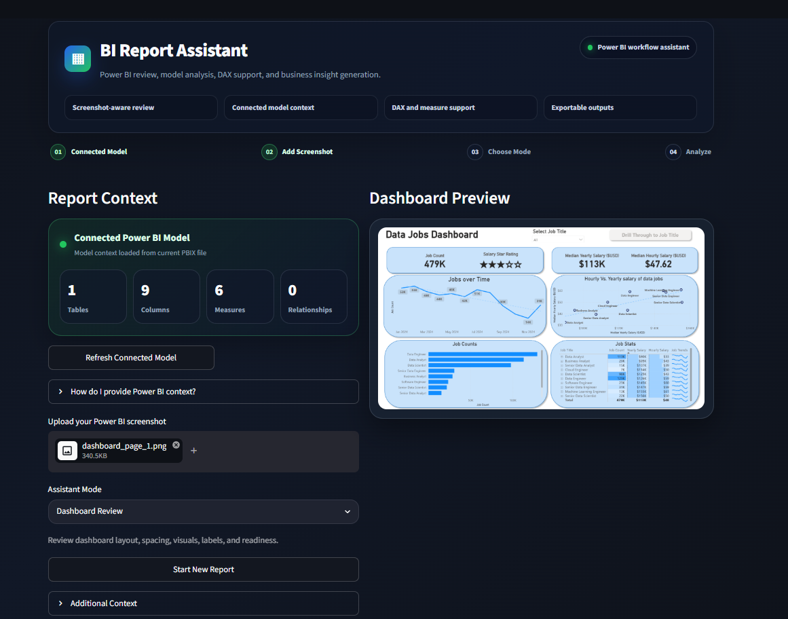
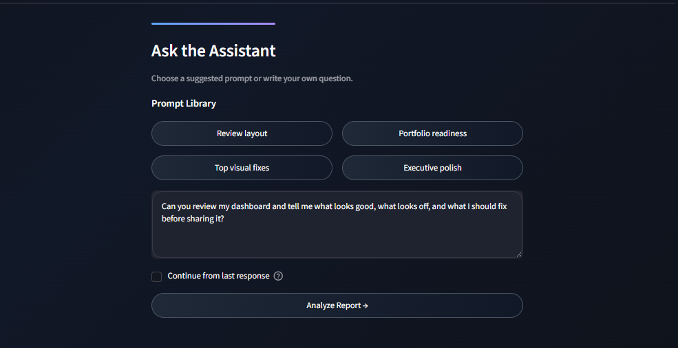
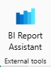

# BI Report Assistant

BI Report Assistant is an AI-powered Streamlit app that helps Power BI users review dashboards, analyze model context, debug DAX, generate measures, write business insights, and create project documentation.

The app provides a guided workflow for common Power BI tasks, including dashboard review, model analysis, DAX troubleshooting, insight writing, and project documentation. Users can upload screenshots, add schema or DAX context, upload supporting files, and choose from assistant modes with built-in prompt suggestions.

## App Preview

### Main Interface



### Prompting Area



## Usage Options

### Quick Web Workflow

Use the hosted Streamlit app for fast feedback without installing anything locally.

Users can:

- Upload a Power BI dashboard screenshot
- Paste schema or DAX context
- Upload optional context files
- Choose an assistant mode
- Use suggested prompts
- Download generated feedback as Markdown

This workflow is best for dashboard reviews, insights, DAX help, README writing, and portfolio project feedback.

### Optional Power BI Desktop Integration

For advanced local use, BI Report Assistant can also be launched from the **External Tools** ribbon in Power BI Desktop.

When launched locally from Power BI Desktop, the app can extract:

- Tables
- Columns
- Measures
- DAX expressions
- Relationships

This workflow is best for model review, measure generation, and deeper Power BI model analysis.

## Key Features

### Dashboard Review

Upload a Power BI dashboard screenshot and receive feedback on layout, spacing, KPI placement, visual hierarchy, chart readability, color consistency, and presentation readiness.

### Model Review

Review Power BI model structure, including tables, columns, measures, relationships, naming clarity, Date table needs, and star schema opportunities.

### DAX Debugging

Check DAX measures for syntax issues, logic problems, naming clarity, safer `DIVIDE()` usage, and better calculation patterns.

### Measure Generator

Generate useful DAX measures based on provided schema, existing measures, or connected model context.

### Insight Writer

Turn dashboard metrics into executive-friendly insights, recommended actions, and dashboard callout text.

### README Writer

Generate professional GitHub README content for Power BI dashboard projects.

### Response History and Follow-Ups

The app stores responses during the session and allows users to continue from the latest assistant response.

### Exportable Outputs

Generated responses can be downloaded as Markdown files.

## Tech Stack

### Web App

- Python
- Streamlit
- OpenAI API
- Pillow
- python-dotenv

### Optional Local Power BI Integration

- pythonnet
- Microsoft ADOMD.NET / Analysis Services client libraries
- Power BI Desktop External Tools



## Setup: Streamlit App

### 1. Clone the repository

```bash
git clone https://github.com/YOUR-USERNAME/bi-report-assistant.git
cd bi-report-assistant
```

### 2. Create and activate a virtual environment

```bash
python -m venv .venv
.venv\Scripts\activate
```

### 3. Install dependencies

```bash
pip install -r requirements.txt
```

### 4. Create a `.env` file

```text
OPENAI_API_KEY=your_api_key_here
```

### 5. Run the app

```bash
streamlit run app.py
```

## Optional: Power BI Desktop External Tool Setup

For direct Power BI Desktop model extraction, see:

```text
POWERBI_EXTERNAL_TOOL_SETUP.md
```

The hosted Streamlit version cannot directly connect to a user's local PBIX model. Direct Power BI model extraction requires the local External Tool setup.

## Environment Variables

```text
OPENAI_API_KEY=your_api_key_here
ADOMD_DLL_PATH=C:\Program Files\Microsoft.NET\ADOMD.NET\160\Microsoft.AnalysisServices.AdomdClient.dll
```

`ADOMD_DLL_PATH` is only needed for the optional local Power BI Desktop integration.

Recommended `.gitignore`:

```text
.env
.venv/
__pycache__/
*.pyc
.streamlit/secrets.toml

powerbi_context.txt
powerbi_model_context.txt
```

## Data Privacy Notes

This app is designed for sample, anonymized, or non-sensitive dashboard context.

Before uploading files, screenshots, or model metadata, users should remove confidential company data, customer information, internal financial details, private strategy, and personally identifiable information.

## Limitations

- The hosted app supports manual screenshot and context uploads.
- Direct PBIX model extraction requires local setup with Power BI Desktop.
- The app does not directly modify PBIX files.
- AI-generated suggestions should be reviewed before being used professionally.

## Future Improvements

- Mode cards instead of a dropdown selector
- Saved project sessions
- PDF export
- Better support for large Power BI models
- Deeper model relationship analysis
- More advanced Date table and star schema detection

## Disclaimer

BI Report Assistant supports Power BI workflow improvement, dashboard review, model analysis, DAX troubleshooting, insight writing, and documentation. AI-generated suggestions should be reviewed before use in professional, academic, or business settings.
